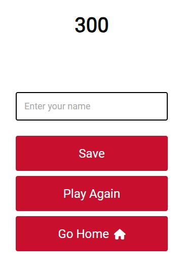
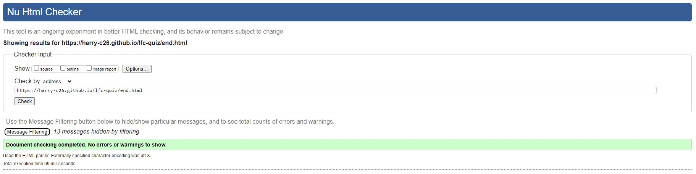

# Liverpool FC Quiz
This is a short quiz to test users knowledge of Liverpool FC. I chose Liverpool for my quiz as I've supported the club for as long as I can remember which makes the topic fun to create and the starting questions easy to put together.

  

##  Features

### Home Page

*  This is a simple landing page with a logo, start button and highscore button. This starts the colour scheme taking the colours from the Liverpool badge.  

### Game Page

* Continuing with the colour theme from the homepage, the game page has an easy to follow question and answer sections with the colour constrasts making is easy to read. The pointer along with the enlarging answer options allow the user to see which answer they're selecting and when chosen will either turn green or red again following the club colours. 

### Progress Bar

* The progress bar allows the user to see how they're getting on with the quiz and above the bar it shows what question they're on and how many there are in total. 

### Score Counter

* The score counter allows the user to see how many answers they've got right as they progress through the quiz. 

### Save Name Page

* At the end of the quiz the user has the chance to save their name to the leaderboard with their score. Useful for tracking who has scored the most or for a personal challenge to score more the next time they play. 

### Leaderboard

*  A simple leaderboard with the name of the user and their score. 

### Title Page Icon

## Testing

*  The website has been tested on chrome, edge and firefox and has the same appearance on all browsers.
*  The links all work and take you to the relevant page.
*  The website is responsive to different screen sizes and keeps a common layout on them.
*  The save user name field works and will only submit when all of the fields are filled out with the correct information. 

## Validator testing

*  It has been tested on the HTML validator and has passed.
*  It has been tested on the CSS validator and has passed as well.
*  I have checked the website is responsive and functions on a variety of screen sizes using AmIResponsive as well as the inspection devtools.
*  I have also checked the site with Lighthouse which gave an overall score of 100 for accessibility. 

W3 HTML checks:

CSS checks:

Lighthouse check:

## Bugs

### Solved bugs

* There were issues with links not being found for the end page and return home from the highscores page. Both of these were fixed with a change to the link in the relevant file. 
* There was an issue with the highscores now showing but that was due to the colour of the text. 

### Unfixed bugs

* There is a bug with the end page in Mozilla but as yet I haven't been able to fix this. When you put in your name and try to save it the invalid cursor comes up instead of letting you save your score. 

## Credits

### Content

1. Colours - the club colours were from [here](https://teamcolorcodes.com/liverpool-fc-colors/)
2. Youtube - I followed some of this [youtube video](<https://www.youtube.com/watch?v=f4fB9Xg2JEY>) for assistance with this project

### Media

* Logo - the club logo was from [here](<https://logowik.com/liverpool-fc-vector-logo-3183.html>)
* Icon - the club icon for the tab window was from [here](<https://www.iconarchive.com/show/english-football-club-icons-by-giannis-zographos/Liverpool-FC-icon.html>)

### Others to mention

* A special thank you to support team for helping when I needed to take a break having had a number of personal distractions during the modules and completion of this project. 
* The [README guide](https://github.com/kera-cudmore/readme-examples#credits) that Kera Cudmore put together was a great help as well. I've used my previous READme but I based on that on Kera's guide so it's only fair to give credit again.

## Further development plans

* Add further questions so there is a greater question pool to select from.
* Potential to add images, sound or videos throughout the quiz or at the end with tiers depending on the score the user achieves. 

## Things I've learned from my project

* Plan ahead with more thought into how I want me project to go and what the end result should look like. 
* Definitely start writing the README file at the start as part of my planning and use it as a working document. 
* Committing in smaller chunks and more often. 
* Remember less is more. My early ideas were a lot more complicated which would have been too time consuming to create. 
